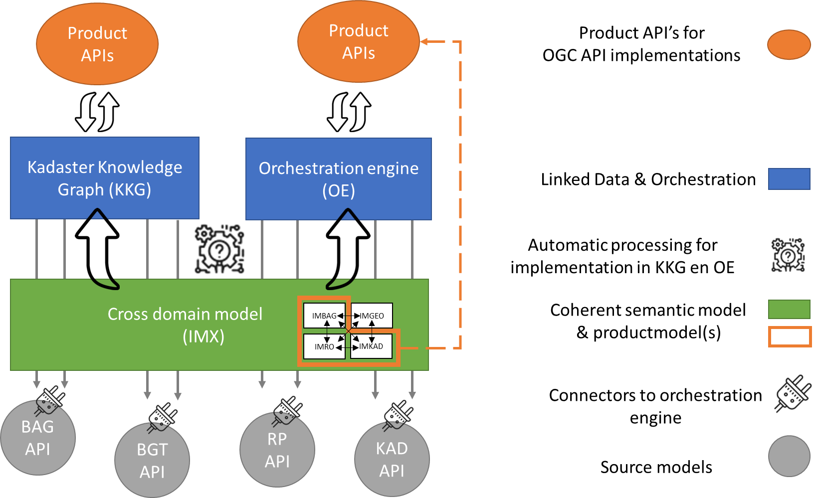

## Use Case: Automatisch vertalen van het cross domain model (IMX) naar implementatiebestanden voor KKG en orchestratie-engine

Binnen een basis- of kernregistratie worden de relaties tussen concepten in het informatiemodel uitgedrukt. Bijvoorbeeld een BAG Nummeraanduiding verwijst naar een BAG OpenbareRuimte. Het samenhangende semantische model beschrijft de relaties tussen concepten in verschillende basis- en kernregistraties. Bijvoorbeeld de relatie tussen een BRT Gebouw, een BAG Pand en een BGT Pand en Overigbouwwerk. Het is als het ware een semantische orchestratielaag over de verschillende registraties heen.

De relaties tussen concepten in verschillende registraties worden gelegd met «traces». Deze «traces» vormen de input voor de Kadaster Knowledge Graph (KKG) en de orchestratie-engine.

Met deze use case willen we het volgende bereiken:

-   Het vertalen van het samenhangende semantische model in implementatiebestanden als input voor de KKG en de orchestratie-engine.
-   Het aansluiten van één of meer product API’s op de orchestratielaag op basis van een productmodel als subset van het semantisch model.

